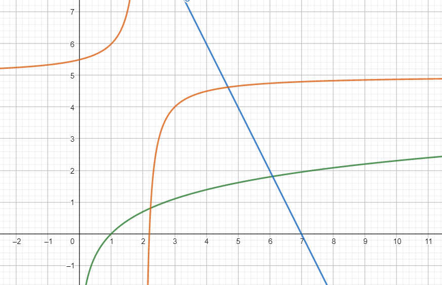
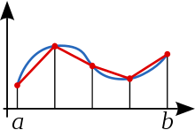
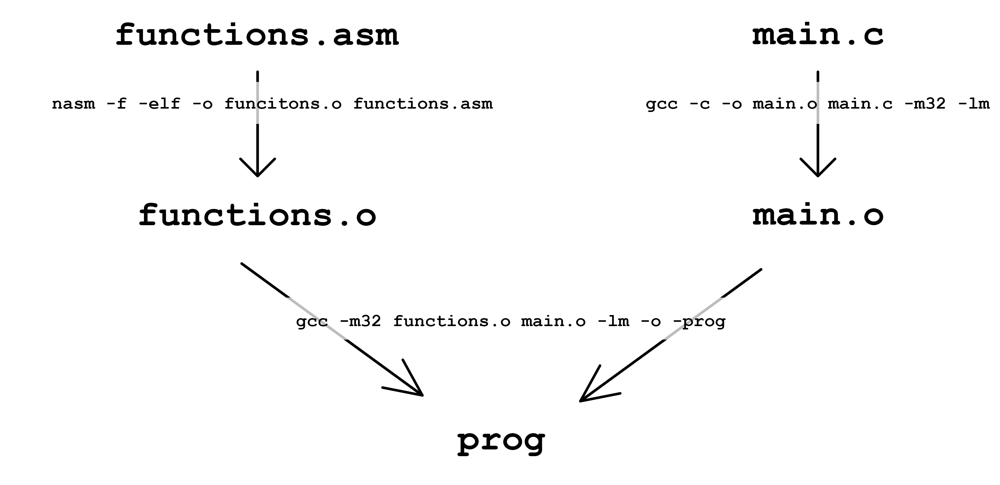

---
author:
- Алексей Кириллов, 105 группа
date: 16 Мая 2021
title: Отчет по 6-ому заданию курса
  \<\<Архитектура ЭВМ и язык ассемблера>\>
---

# Введение

Написана программа, вычисляющая площадь между тремя кривыми, заданными
уравненияем
$$f_1(x) = \ln(x), \ f_2(x) = -2x+14, f_3(x) = \frac{1}{2-x}+6$$ Их
графики:

{width="70%"}

Кроме этого, программа может выполнять и некоторые другие вычисления.
Всего есть 5 режимов работы:

-   Вычисления площади между тремя кривыми на произвольном отрезке и с
    выбранной точностью

-   Поиск точек пересечения любых двух из трех имеющихся функций на
    любом отрезке с любой точностью

-   Поиск интеграла под функций на произвольном отрезке с заданной
    точностью

-   Вычисление значения функции в произвольной точке

-   Тестирование программы

Программа релизованна как консолное приложение, которое может быть
запущено с разными ключами и аргументами.

Логически проект делится на пять части:

-   Вычисления значения функций и их производных

-   Вычисление с заданной точностью точек пересечения кривых

-   Вычисление интегралов под кривыми

-   Обработка результатов предыдущих этапов для вычисления искомой
    площади

-   Обработка аргументов командной строки

# Вычисления значения функций и производных

Для вычисления значения, которая принимает фунция в заданной точке, на
языке ассемблера был написан код, исполняемый на сопроцессоре X87 и
вычисляющей искомое значение. Такое решение обусловлено тем, что
процессорв X87 оперирует числами расширенной точность размером 10 байт и
имеющих мантиссу 63 байта. Это гарантирует высокую точность результатов
вычислений, посколько уменьшается количество ошибок из-за округлений.

Для вычисления значения функции была составлена польская запись ее
формулы и, собственно, написана на ассемберном коде.

# Нахождение точек пересечения кривых

Для нахождения точек пересечения был использован метод Ньютона (или
метод касательных). Метод Ньютона ищет решения уравнения $f(x) = 0$,
строя последовательность $\{x_n\}$ по правилу:
$$x_n = x_{n-1} - \frac{f(x_{n-1})}{f'(x_{n-1})}$$ Такая
последовательность сходится к решению с асимптотикой $O(\frac{1}{n^2})$,
где n - число итераций. Для решения уравнения $f(x)=g(x)$
рассматривалась функция $h(x) = f(x) - g(x)$ и искалось ее решение
методом Ньютона.

# Метод вычисления интегралов

Для вычисления интегралов был использован метод трапеций. Метод
заключается в разбиении отрезка, на котором вычисляется интеграл, на
равные отрезки и вычислении на них площадей трапеций, образованных
точками $x_k, x_{k+1}, f(x_{k+1}), f(x_k)$ с последующим суммированием.
Метод может быть проиллюстрирован следующей картинкой:

{width="40%"}

Метод был применен для вычисления подынтегральных площей на отрезках,
координаты которых были вычислены на предыдущем этапе.

# Вычисление площади между тремя кривыми

Сложность этого этапа заключается в том, что надо понять, с какими
знаками надо взять подынтегральные площади, чтобы получить площадь между
тремя кривыми. Вообще говоря, всего есть 36 возможных вариантов:

-   6 = 3! вариантов для взаимного точек пересечения кривых по оси
    абсцисс

-   6 = 3! вариантов для взаимного точек пересечения кривых по оси
    ординат

Безусловно, ручной перебор всех этих вариантов утомителен. К счастью,
удалось свести перебор до 6 вариантов. Для это был создан массив

> `float (*funs_array[3]) (float, float)`

сотоящий из трех рассматриваемых функций, что упрощяло доступ к
функциям. Далее, из точек пересечения были определены левая, средняя и
правая. Благодярая этому вся задача была сведена к перебору положения
средней точки и определению координаты средней точки над кривой,
соединяющий оставшиеся две точки.

# Работа с командной строкой

Эта часть программа оказалось, пожалуй, самой объемной. Были придуманы
лаконичные названия для ключей и порядок их расположения в командной
строке.

Для чтения ключей было написано дерево типа `if/else` соответсвия
аргументов возможным шаблонам. Перед обращенем к элементу массива `argv`
проверялось, не будет ли выхода за границу. После этого элемент
`argv[i]` сравнивался с возможными трафаретами. В случае, если ни один
из шаблонов не подошел, выводилось сообщение об ошибке и сам аргумент,
на котором произошла ошибка.

Также была написана справка по пользования программой, выводящаяся при
вводе ключа `--help`.

# Сборка

Сборка программы проводилась с помощью Makefile. В Makefile были
написаны команды, которые генерирует по исходным двум файлам вначале
объектные файлы, а затем их объектных файлов - итоговое приложение. В
Linux оно не имеет разрешения (указываемого после точки), но можно
считать что по сути у него разрешени `.exe`. Это итоговое приложения и
явлется итговой работающей программой. Кроме того, в Makefile
предусмотрена директива `clean`, которая удаляет из дирректории проекта
объектные файлы и саму программу `prog`. Схема компановки изображениа на
рисунке ниже. Там изображена диаграмма создания файлов и команды,
которые были использованы.

{width="100%"}
